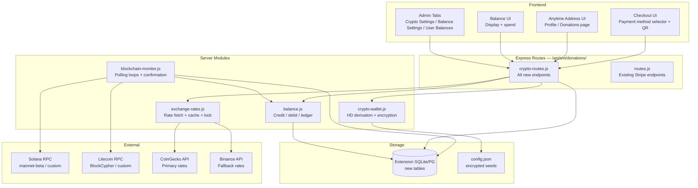
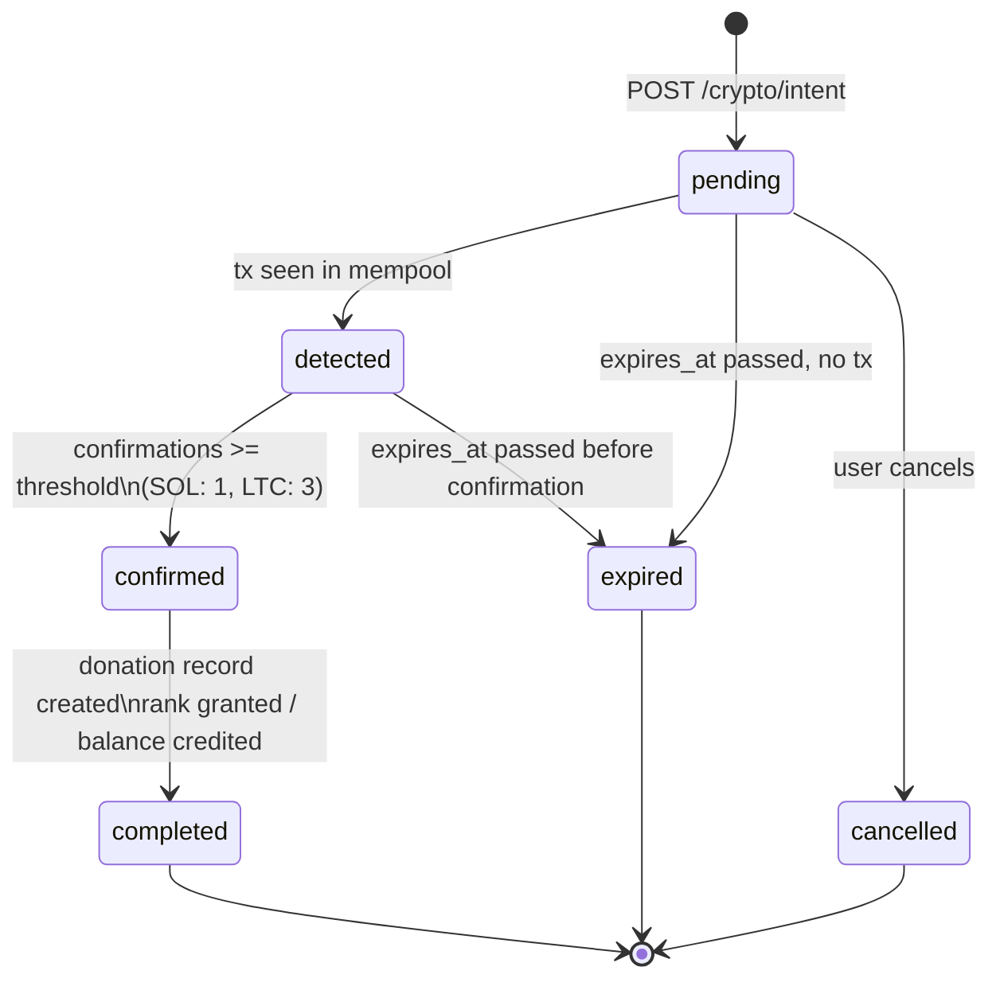
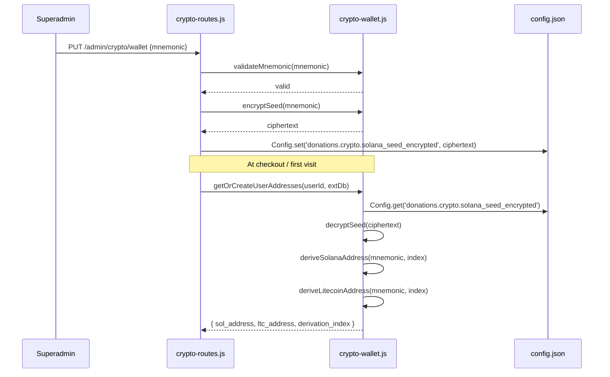
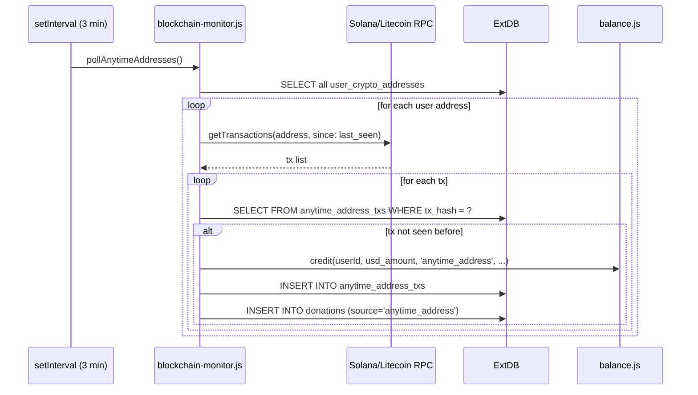
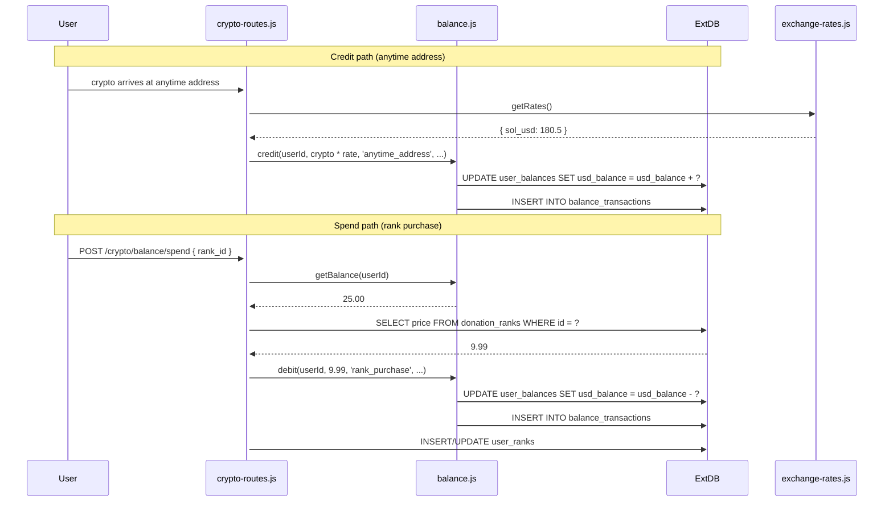

# Crypto Donation Support — Design Document

## Overview

This feature extends the existing donations extension with Solana (SOL) and Litecoin (LTC) cryptocurrency payment support. It introduces three payment modes:

1. **Payment Intent checkout** — user selects a rank, gets a unique derived address + locked price, pays within 240 hours
2. **Anytime Address** — permanent per-user HD-derived address; any incoming transaction credits the user's USD balance
3. **Balance spend** — accumulated USD balance can be spent on ranks directly

The implementation adds five new server modules, six new database tables, and three new admin tabs, all wired into the existing `extDb`/`Config`/`authenticateToken` infrastructure without touching core server files.

### Key Design Decisions

- **HD Wallet over hot wallets**: A single BIP39 mnemonic derives unlimited unique addresses deterministically, eliminating the need to manage individual private keys per payment.
- **Price locking at intent creation**: Exchange rate volatility is neutralized by storing `locked_crypto_amount` at checkout time; the user pays exactly that amount regardless of subsequent price swings.
- **USD-denominated balance**: All internal accounting is in USD (8 decimal precision). Display currency is a view-layer concern converted at render time.
- **Polling over webhooks as primary**: Polling is self-contained and requires no external webhook service configuration. Webhook endpoints are provided as an optional acceleration layer.
- **Superadmin-only seed management**: Seed phrases are AES-256 encrypted before storage in `config.json`. The decryption key is derived from `JWT_SECRET + static salt` — never stored separately.

---

## Architecture



### Module Responsibilities

| Module | Responsibility |
|---|---|
| `crypto-wallet.js` | BIP39 validation, AES-256 encrypt/decrypt, Solana + Litecoin address derivation, index allocation |
| `exchange-rates.js` | Fetch SOL/USD + LTC/USD from CoinGecko + Binance, 60s cache, median selection, rate locking |
| `blockchain-monitor.js` | `setInterval` polling for payment intents (SOL 5s, LTC 10s) and anytime addresses (3 min), confirmation gating, exponential backoff on RPC failure |
| `balance.js` | Credit/debit user balances, ledger writes, admin adjustments, display-currency conversion |
| `crypto-routes.js` | All new HTTP endpoints; delegates to the four modules above |

---

## Components and Interfaces

### crypto-wallet.js

```js
// Encryption
encryptSeed(mnemonic: string): string          // AES-256-CBC, key = PBKDF2(JWT_SECRET + SALT)
decryptSeed(ciphertext: string): string

// Validation
validateMnemonic(mnemonic: string): boolean    // bip39.validateMnemonic

// Address derivation
deriveSolanaAddress(mnemonic: string, index: number): { address: string, publicKey: Buffer }
deriveLitecoinAddress(mnemonic: string, index: number): { address: string }

// Index management (reads/writes user_crypto_addresses)
getOrCreateUserAddresses(userId: string, extDb): Promise<{ sol_address, ltc_address, derivation_index }>
```

Derivation paths:
- Solana: `m/44'/501'/0'/0'/{index}'` via `ed25519-hd-key`
- Litecoin: `m/44'/2'/0'/0/{index}` via `bitcoinjs-lib` + `tiny-secp256k1`

### exchange-rates.js

```js
getRates(): Promise<{ sol_usd: number, ltc_usd: number, fetched_at: number }>
// Returns cached value if age < 60s, else fetches fresh

lockRate(usd_amount: number, coin: 'sol'|'ltc'): Promise<{ crypto_amount: number, rate_used: number }>
// Calls getRates(), computes crypto_amount = usd_amount / rate, returns both

getDisplayRate(coin: string): Promise<number>  // for balance display conversion
```

Rate sources (tried in order):
1. CoinGecko: `https://api.coingecko.com/api/v3/simple/price?ids=solana,litecoin&vs_currencies=usd`
2. Binance: `https://api.binance.com/api/v3/ticker/price?symbol=SOLUSDT` + `LTCUSDT`

If sources disagree by >2%, log warning and use median. If all fail, throw `ExchangeRateUnavailableError`.

### blockchain-monitor.js

```js
startMonitoring(extDb, balanceManager)
// Launches all polling intervals

// Internal polling functions
pollSolanaIntents(extDb)      // every 5s
pollLitecoinIntents(extDb)    // every 10s
pollAnytimeAddresses(extDb)   // every 3 min

// Confirmation logic
checkSolanaTransaction(address, expectedAmount, tolerance): Promise<TxResult>
checkLitecoinAddress(address): Promise<TxResult[]>

// Completion
completeCryptoIntent(intentId, txHash, confirmedAmount, extDb, balanceManager)
processAnytimeTx(userId, txHash, cryptoAmount, coin, extDb, balanceManager)
```

Exponential backoff on RPC failure: delays `[1s, 2s, 4s, 8s, 16s]`, then logs alert and skips cycle.

### balance.js

```js
credit(userId, amountUsd, source, description, extDb): Promise<void>
debit(userId, amountUsd, source, description, extDb): Promise<void>
getBalance(userId, extDb): Promise<number>                    // returns USD
adminAdjust(adminId, userId, amountUsd, reason, extDb): Promise<void>
getLedger(userId, limit, extDb): Promise<BalanceTx[]>
convertForDisplay(amountUsd, targetCurrency, rates): number
```

### crypto-routes.js — Endpoint Summary

| Method | Path | Auth | Description |
|---|---|---|---|
| `GET` | `/crypto/rates` | public | Current SOL/USD + LTC/USD rates |
| `POST` | `/crypto/intent` | optionalAuth | Create payment intent (rank checkout) |
| `GET` | `/crypto/intent/:id` | optionalAuth | Poll intent status |
| `POST` | `/crypto/intent/:id/cancel` | authenticateToken | Cancel own intent |
| `GET` | `/crypto/my-addresses` | authenticateToken | Get/derive anytime addresses |
| `GET` | `/crypto/balance` | authenticateToken | Get balance + ledger |
| `POST` | `/crypto/balance/spend` | authenticateToken | Spend balance on rank |
| `POST` | `/crypto/webhook/solana` | public (sig verified) | Solana webhook accelerator |
| `POST` | `/crypto/webhook/litecoin` | public (sig verified) | Litecoin webhook accelerator |
| `GET` | `/admin/crypto/config` | admin | Get crypto config (masked) |
| `PUT` | `/admin/crypto/config` | superadmin | Update RPC endpoints, webhook secrets |
| `PUT` | `/admin/crypto/wallet` | superadmin | Set/update seed phrases |
| `GET` | `/admin/crypto/status` | admin | Live blockchain connectivity status |
| `GET` | `/admin/crypto/intents` | admin | List payment intents with filters |
| `POST` | `/admin/crypto/intents/:id/confirm` | admin | Manual confirmation of stale intent |
| `GET` | `/admin/balances` | admin | List user balances |
| `POST` | `/admin/balances/:userId/adjust` | admin | Manual balance adjustment |

---

## Data Models

### New Tables (appended to schema.sql)

```sql
-- HD wallet derivation index per user
CREATE TABLE IF NOT EXISTS user_crypto_addresses (
    id TEXT PRIMARY KEY,
    user_id TEXT NOT NULL UNIQUE,
    derivation_index INTEGER NOT NULL,
    sol_address TEXT,
    ltc_address TEXT,
    created_at TEXT DEFAULT (CURRENT_TIMESTAMP),
    FOREIGN KEY (user_id) REFERENCES users(id)  -- core users table
);

-- Payment intents (rank checkout flow)
CREATE TABLE IF NOT EXISTS crypto_payment_intents (
    id TEXT PRIMARY KEY,                          -- uuid
    user_id TEXT,                                 -- nullable for guests
    rank_id TEXT,                                 -- nullable for custom-amount
    coin TEXT NOT NULL,                           -- 'sol' | 'ltc'
    sol_address TEXT,
    ltc_address TEXT,
    amount_usd REAL NOT NULL,
    locked_crypto_amount REAL NOT NULL,           -- amount at creation time
    locked_exchange_rate REAL NOT NULL,           -- rate used for locking
    tolerance_pct REAL DEFAULT 5.0,
    status TEXT DEFAULT 'pending',                -- pending|detected|confirmed|completed|expired|cancelled
    tx_hash TEXT,
    confirmed_amount_crypto REAL,
    confirmations INTEGER DEFAULT 0,
    minecraft_username TEXT,                      -- for guests
    expires_at TEXT NOT NULL,                     -- created_at + 240h
    detected_at TEXT,
    confirmed_at TEXT,
    completed_at TEXT,
    created_at TEXT DEFAULT (CURRENT_TIMESTAMP)
);

-- Anytime address transaction deduplication
CREATE TABLE IF NOT EXISTS anytime_address_txs (
    id TEXT PRIMARY KEY,
    user_id TEXT NOT NULL,
    tx_hash TEXT NOT NULL UNIQUE,
    coin TEXT NOT NULL,
    crypto_amount REAL NOT NULL,
    usd_amount REAL NOT NULL,
    exchange_rate REAL NOT NULL,
    status TEXT DEFAULT 'credited',
    created_at TEXT DEFAULT (CURRENT_TIMESTAMP)
);

-- User USD balances
CREATE TABLE IF NOT EXISTS user_balances (
    user_id TEXT PRIMARY KEY,
    usd_balance REAL NOT NULL DEFAULT 0.0,       -- 8 decimal precision
    updated_at TEXT DEFAULT (CURRENT_TIMESTAMP)
);

-- Balance transaction ledger
CREATE TABLE IF NOT EXISTS balance_transactions (
    id TEXT PRIMARY KEY,
    user_id TEXT NOT NULL,
    type TEXT NOT NULL,                           -- 'credit' | 'debit'
    amount_usd REAL NOT NULL,
    source TEXT NOT NULL,                         -- 'stripe_custom'|'crypto_intent'|'anytime_address'|'rank_purchase'|'admin_adjustment'
    description TEXT,
    reference_id TEXT,                            -- donation id, intent id, etc.
    admin_id TEXT,                                -- set for admin_adjustment
    created_at TEXT DEFAULT (CURRENT_TIMESTAMP)
);

-- User display preferences
CREATE TABLE IF NOT EXISTS user_preferences (
    user_id TEXT PRIMARY KEY,
    balance_display_currency TEXT DEFAULT 'usd', -- 'usd'|'sol'|'ltc'|'eur'|'gbp'
    updated_at TEXT DEFAULT (CURRENT_TIMESTAMP)
);

-- Indices
CREATE INDEX IF NOT EXISTS idx_crypto_intents_status ON crypto_payment_intents(status);
CREATE INDEX IF NOT EXISTS idx_crypto_intents_coin ON crypto_payment_intents(coin);
CREATE INDEX IF NOT EXISTS idx_crypto_intents_user ON crypto_payment_intents(user_id);
CREATE INDEX IF NOT EXISTS idx_crypto_intents_expires ON crypto_payment_intents(expires_at);
CREATE INDEX IF NOT EXISTS idx_anytime_txs_user ON anytime_address_txs(user_id);
CREATE INDEX IF NOT EXISTS idx_anytime_txs_hash ON anytime_address_txs(tx_hash);
CREATE INDEX IF NOT EXISTS idx_balance_txs_user ON balance_transactions(user_id);
CREATE INDEX IF NOT EXISTS idx_user_crypto_addr_user ON user_crypto_addresses(user_id);
```

### config.json additions (under `donations.crypto`)

```json
{
  "donations": {
    "crypto": {
      "solana_seed_encrypted": "<AES-256-CBC ciphertext>",
      "litecoin_seed_encrypted": "<AES-256-CBC ciphertext>",
      "solana_rpc_primary": "https://api.mainnet-beta.solana.com",
      "solana_rpc_secondary": "",
      "litecoin_rpc_primary": "https://api.blockcypher.com/v1/ltc/main",
      "litecoin_rpc_secondary": "",
      "solana_enabled": true,
      "litecoin_enabled": true,
      "solana_webhook_secret": "",
      "litecoin_webhook_secret": "",
      "balance_display_currencies": ["usd", "sol", "ltc", "eur", "gbp"]
    }
  }
}
```

### Payment Intent Lifecycle



---

## HD Wallet Derivation Flow



Index allocation: `SELECT MAX(derivation_index) + 1 FROM user_crypto_addresses` — atomic upsert prevents collisions. Index 0 is reserved for the admin "hot check" address.

---

## Anytime Address Polling Architecture



---

## Balance System Flow



---

## Admin UI Tab Structure

Three new tabs added to `DonationsAdminPage`:

### "Crypto Settings" tab
- Blockchain enable/disable toggles (Solana / Litecoin)
- Live connectivity status badge per chain (green/yellow/red)
- RPC endpoint fields (primary + secondary) — visible to all admins
- Webhook secret fields — visible to all admins
- **Wallet Setup section** (superadmin only — hidden + "Superadmin only" notice for other roles):
  - Seed phrase input (masked, shows first + last word only after save)
  - "Generate new seed" button
  - Derivation path display (read-only)
- Summary: pending intents count, confirmed today, failed/expired

### "Balance Settings" tab
- Allowed display currencies (multi-select checkboxes)
- Minimum balance threshold for rank purchase
- Balance expiry toggle + duration (optional)

### "User Balances" tab
- Searchable table: username, USD balance, last transaction, display currency
- Per-row "Adjust" button → modal with amount (±), reason field (required)
- Audit log view per user

---

## Security Considerations

### Seed Phrase Encryption
- Key derivation: `PBKDF2(JWT_SECRET + 'crypto-wallet-salt-v1', 100000 iterations, SHA-256)` → 32-byte AES key
- Cipher: AES-256-CBC with random IV prepended to ciphertext (hex-encoded)
- The plaintext mnemonic exists in memory only during address derivation; it is never logged, never sent to the client
- Admin UI displays only `word1 *** *** ... *** wordN` — the masked confirmation pattern

### Superadmin Gating
- `requireSuperadmin` middleware checks `role === 'superadmin'` from core `users` table
- Wallet setup endpoints return 403 for all other roles
- Admin UI hides wallet fields client-side as a UX convenience; server enforces the restriction

### Transaction Validation
- Amount tolerance: `|received - expected| / expected <= 0.05`
- Address ownership: payment intent stores the exact derived address; incoming tx destination is verified against it
- Duplicate prevention: `tx_hash UNIQUE` constraint in `anytime_address_txs`; `completeCryptoIntent` uses `UPDATE ... WHERE status != 'completed'` (same pattern as existing `completeDonation`)
- Webhook HMAC: `crypto.createHmac('sha256', secret).update(rawBody).digest('hex')` compared in constant time via `crypto.timingSafeEqual`

### Rate Limiting
- Exchange rate API calls are cached 60s to prevent abuse
- Payment intent creation should be rate-limited per user (max 5 active intents)

---

## Correctness Properties

*A property is a characteristic or behavior that should hold true across all valid executions of a system — essentially, a formal statement about what the system should do. Properties serve as the bridge between human-readable specifications and machine-verifiable correctness guarantees.*

### Property 1: Address derivation is deterministic

*For any* valid BIP39 mnemonic and derivation index, calling `deriveSolanaAddress(mnemonic, index)` or `deriveLitecoinAddress(mnemonic, index)` twice with the same inputs must produce identical addresses.

**Validates: Requirements 21.2**

---

### Property 2: Seed encryption round-trip

*For any* valid BIP39 mnemonic string, encrypting it with `encryptSeed` and then decrypting with `decryptSeed` must produce the original mnemonic unchanged.

**Validates: Requirements 19.3**

---

### Property 3: BIP39 mnemonic validation correctness

*For any* string, `validateMnemonic` must return `true` if and only if the string is a valid BIP39 mnemonic (12 or 24 words from the BIP39 wordlist with a valid checksum), and `false` for all other inputs.

**Validates: Requirements 19.2**

---

### Property 4: Exchange rate locking invariant

*For any* USD amount and coin type, the `locked_crypto_amount` stored on a payment intent must equal `amount_usd / locked_exchange_rate` within floating-point precision (±0.000001), and `locked_exchange_rate` must equal the rate returned by `getRates()` at intent creation time.

**Validates: Requirements 3.7, 3.8**

---

### Property 5: Median rate selection

*For any* non-empty array of exchange rates from multiple sources, the rate selected by `Exchange_Rate_Manager` must be the statistical median of the input rates — never higher than the maximum or lower than the minimum of the inputs.

**Validates: Requirements 3.4**

---

### Property 6: Amount tolerance acceptance/rejection

*For any* payment intent with `locked_crypto_amount = L` and any received amount `R`, the transaction must be accepted if and only if `|R - L| / L <= 0.05`. Amounts outside this range must always be rejected; amounts inside must always be accepted.

**Validates: Requirements 1.8, 2.8, 10.3**

---

### Property 7: Confirmation threshold state transition

*For any* payment intent with coin type `c`, when the detected transaction's confirmation count reaches or exceeds `threshold(c)` (1 for SOL, 3 for LTC), the intent status must transition to `confirmed`. The status must never transition to `confirmed` before the threshold is reached.

**Validates: Requirements 1.5, 2.5, 4.4, 4.5**

---

### Property 8: Intent expiry invariant

*For any* payment intent where `expires_at < now` and `status = 'pending'` or `status = 'detected'`, the monitor must set `status = 'expired'`. An expired intent must never transition back to any other status.

**Validates: Requirements 1.7, 2.7, 4.6**

---

### Property 9: Webhook HMAC verification

*For any* webhook payload and secret, a request with a valid HMAC-SHA256 signature must be accepted (HTTP 200), and a request with any other signature (including a modified payload or wrong secret) must be rejected (HTTP 401). This must hold for all possible payload contents.

**Validates: Requirements 5.2, 5.3, 10.5**

---

### Property 10: Duplicate transaction idempotence

*For any* transaction hash `h`, processing it once or processing it multiple times must produce exactly the same final state: one donation record, one balance credit or rank grant, and no duplicate `anytime_address_txs` rows. The `tx_hash UNIQUE` constraint enforces this at the DB layer; the application layer must not error on the second attempt.

**Validates: Requirements 5.8, 10.7**

---

### Property 11: Address-to-intent binding

*For any* confirmed transaction, the destination address of the on-chain transaction must exactly match the `sol_address` or `ltc_address` stored on the corresponding payment intent. A transaction arriving at any other address must not complete that intent.

**Validates: Requirements 10.4**

---

### Property 12: Balance ledger invariant

*For any* user and any sequence of credit and debit operations, the value returned by `getBalance(userId)` must equal the sum of all `credit` entries minus the sum of all `debit` entries in `balance_transactions` for that user. This invariant must hold after every individual operation.

**Validates: Requirements 22.1, 22.8**

---

### Property 13: Balance credit equals donation amount

*For any* completed custom donation (Stripe or crypto) with amount `A` in USD, the user's balance must increase by exactly `A`. For crypto donations, `A = crypto_amount * exchange_rate_at_confirmation`. No rounding or truncation beyond 8 decimal places is permitted.

**Validates: Requirements 22.2, 22.3, 22.4**

---

### Property 14: Balance debit grants rank

*For any* balance spend operation where `getBalance(userId) >= rank.price`, the operation must atomically deduct `rank.price` from the balance and create or update a `user_ranks` record. If the balance is insufficient, neither the debit nor the rank grant must occur.

**Validates: Requirements 22.6, 22.7**

---

### Property 15: Transaction serialization round-trip

*For any* valid `Transaction` object, serializing it to JSON with `Transaction_Serializer` and then parsing the result with `Transaction_Parser` must produce an object that is deeply equal to the original, with all required fields (`blockchain_type`, `tx_hash`, `amount`, `confirmations`, `timestamp`) present and unchanged.

**Validates: Requirements 18.1, 18.2, 18.4**

---

### Property 16: Derived address format validity

*For any* derivation index, `deriveSolanaAddress` must produce a string that passes Solana base58 public key validation, and `deriveLitecoinAddress` must produce a string that passes Litecoin base58check address validation. No derived address may be the zero address or an invalid encoding.

**Validates: Requirements 1.1, 2.1, 10.1**

---

### Property 17: Exponential backoff sequence

*For any* sequence of consecutive RPC failures, the retry delay sequence produced by the backoff logic must be a non-decreasing sequence starting at 1s and doubling each step: `[1000, 2000, 4000, 8000, 16000]` ms. After 5 failures the monitor must skip the cycle rather than continuing to retry.

**Validates: Requirements 4.8, 11.1**

---

### Property 18: Payment intent ID uniqueness

*For any* set of concurrently created payment intents, all generated IDs must be distinct. No two intents may share the same `id` or the same derived address within the same coin type.

**Validates: Requirements 10.6**

---

## Error Handling

### Strategy Overview

All errors are handled at the module boundary. No error propagates silently — every catch block either retries, degrades gracefully, or surfaces to the admin dashboard.

| Failure Scenario | Handler | Recovery |
|---|---|---|
| RPC call fails (single) | Exponential backoff: 1s → 2s → 4s → 8s → 16s | Skip cycle after 5 retries; log alert |
| All RPC endpoints down | Disable polling loop | Surface red status in admin dashboard; re-enable on next successful ping |
| Exchange rate fetch fails | Use last cached rate (up to 5 min stale) | Log warning; reject new intents if cache > 5 min old |
| All rate sources unavailable | Throw `ExchangeRateUnavailableError` | Return 503 on checkout; display user-facing error |
| DB write fails on intent complete | Retry up to 3 times with 500ms delay | Mark intent `completed_pending_rank`; hourly retry job |
| Rank assignment fails | Mark donation `completed_pending_rank` | Hourly cron scans and retries; admin manual grant fallback |
| Seed decryption fails | Log error, disable crypto payments | Alert admin; never crash the server process |
| Webhook signature invalid | Return 401, log attempt with IP | No retry; treat as potential attack |
| Webhook for unknown intent | Log orphaned event | No action; admin can view in logs |
| Balance debit with insufficient funds | Return 400 with shortfall amount | No state change; user prompted to top up |
| Duplicate tx_hash insert | Catch UNIQUE constraint violation | Silently skip (idempotent); log at debug level |

### Error Classes

```js
// extensions/donations/server/crypto/errors.js
class ExchangeRateUnavailableError extends Error {}
class SeedDecryptionError extends Error {}
class InsufficientBalanceError extends Error { constructor(required, available) { ... } }
class InvalidMnemonicError extends Error {}
class WebhookSignatureError extends Error {}
class IntentExpiredError extends Error {}
class DuplicateTransactionError extends Error {}
```

### Logging Convention

All crypto module logs use the prefix `[Donations/Crypto]` for easy filtering:

```
[Donations/Crypto] ✅ Intent completed: <id> — user <userId> — <coin> <amount>
[Donations/Crypto] ⚠️  Exchange rate stale (>5min), rejecting new intents
[Donations/Crypto] ❌ RPC failure (attempt 3/5): <error>
[Donations/Crypto] 🔒 Webhook signature mismatch from <ip>
```

Seed phrases and private keys are **never** included in any log statement. The `encryptSeed`/`decryptSeed` functions must not log their arguments.

---

## Testing Strategy

### Dual Testing Approach

Both unit tests and property-based tests are required. They are complementary:

- **Unit tests** cover specific examples, integration points, and error conditions
- **Property tests** verify universal invariants across randomized inputs

### Property-Based Testing

**Library**: [`fast-check`](https://github.com/dubzzz/fast-check) (Node.js, TypeScript-compatible, well-maintained)

**Configuration**: Minimum 100 runs per property (`{ numRuns: 100 }`). Each test is tagged with a comment referencing the design property.

**Tag format**: `// Feature: crypto-donation-support, Property N: <property_text>`

**Property test file**: `tests/crypto-donation-support.property.test.js`

Each of the 18 correctness properties above maps to exactly one property-based test:

| Property | Test Description | fast-check Arbitraries |
|---|---|---|
| P1: Address determinism | Same (mnemonic, index) → same address | `fc.string()`, `fc.nat()` |
| P2: Seed encryption round-trip | `decrypt(encrypt(m)) === m` | `fc.string()` (valid mnemonics) |
| P3: BIP39 validation | Valid mnemonics accepted, others rejected | `fc.string()`, known valid mnemonics |
| P4: Rate locking invariant | `locked_amount = usd / rate` | `fc.float()`, `fc.float()` |
| P5: Median rate selection | Median within [min, max] | `fc.array(fc.float({ min: 0.01 }), { minLength: 1 })` |
| P6: Tolerance acceptance | Accept iff `|R-L|/L <= 0.05` | `fc.float()`, `fc.float()` |
| P7: Confirmation threshold | Status = confirmed iff confs >= threshold | `fc.nat()`, `fc.constantFrom('sol','ltc')` |
| P8: Expiry invariant | Expired intent never un-expires | `fc.date()` |
| P9: Webhook HMAC | Valid sig accepted, invalid rejected | `fc.string()`, `fc.string()` |
| P10: Duplicate tx idempotence | Process twice = process once | `fc.string()` (tx hashes) |
| P11: Address-to-intent binding | Wrong address never completes intent | `fc.string()` (addresses) |
| P12: Balance ledger invariant | `balance = sum(credits) - sum(debits)` | `fc.array(fc.record({type, amount}))` |
| P13: Credit equals donation amount | `balance_delta = amount` | `fc.float({ min: 0.01 })` |
| P14: Debit grants rank atomically | Debit + rank grant or neither | `fc.float()`, rank records |
| P15: Serialization round-trip | `parse(serialize(tx)) deepEqual tx` | `fc.record(...)` (Transaction shape) |
| P16: Derived address format | All derived addresses pass format check | `fc.nat({ max: 10000 })` |
| P17: Backoff sequence | Delays = [1000, 2000, 4000, 8000, 16000] | `fc.nat({ max: 5 })` |
| P18: Intent ID uniqueness | All IDs in a batch are distinct | `fc.nat({ max: 1000 })` |

### Unit Tests

**File**: `tests/crypto-donation-support.test.js`

Focus areas:
- `completeCryptoIntent()` — verifies donation record creation, rank grant, balance credit in one transaction
- `processAnytimeTx()` — verifies deduplication via `tx_hash` uniqueness
- `requireSuperadmin` middleware — verifies 403 for non-superadmin roles
- Stripe custom donation → balance credit path (integration with existing `completeDonation`)
- Admin balance adjustment — verifies audit log entry is created
- Exchange rate fallback — primary source down, secondary used
- All-sources-down — checkout returns 503
- Webhook for unknown intent — returns 200, no DB write
- `balance/spend` with insufficient funds — returns 400, no state change

### Integration Tests

End-to-end flows tested with an in-memory SQLite instance:

1. **Crypto checkout flow**: `POST /crypto/intent` → mock RPC confirms tx → `GET /crypto/intent/:id` returns `completed`
2. **Anytime address flow**: address derived → mock tx detected → balance credited → ledger entry created
3. **Balance spend flow**: balance credited → `POST /crypto/balance/spend` → rank granted → balance debited
4. **Webhook acceleration**: `POST /crypto/webhook/solana` with valid HMAC → intent completed immediately

### Migration Testing

- Run schema migration on a database that already has the existing `donations`, `user_ranks`, `rank_conversions` tables
- Verify all new tables are created without dropping existing data
- Verify existing Stripe checkout flow still works after migration
